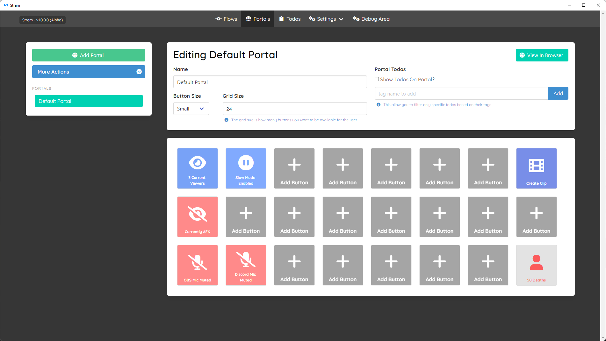

# Strem
A free and open source automation tool geared for assisting streamers.

[![Documentation][gitbook-image]][gitbook-url] [![Discord][discord-image]][discord-invite-url]

> Currently we are only building for windows officially, but custom cut down builds can probably be built for other platforms.

## What Does It Do?

It lets you build complex logic `flows` from `triggers` and `tasks` which can drive actions in 3rd party apps/tools like OBS and Twitch.

> For example you may want to play a meme on OBS every time chat contains "lollerskates", so you would make a twitch chat trigger, and have a task to show an obs source.

### Features
- Simple to use application (open source + plugin mechanism)
- Integrations with `OBS` from tasks/triggers (v28 or with v4 websocket plugin)
- Integrations with `Twitch`, `Twitter`, `SteamElements` and others in the future
- Smart Variables (Allows variables to be tied to contexts, i.e one `death-count` variable for each game)
- Sub Flow Support (Express branching logic in flows, i.e `if statements` with multiple possible outcomes)
- `Todo` system to let you auto generate reminders to do things during/after streams
- `Portal` system lets you setup buttons to drive your `Flows`

> Currently this is the most ALPHA of all alphas, so by all means use it, but just keep in mind this is SUPER early days.

## How Do I Install/Run It?

- You can install via `winget` using `winget install Strem.App` then running it via `strem` on the terminal/command line
- You can manually install it by going to [releases](https://github.com/strem-app/strem/releases/latest), download the latest zip file and put it in a directory somewhere and run `strem.exe`

> Currently only windows is supported, but only a few things realistically require windows so in the long run we may pull those dependencies out to support other platforms too (i.e file browsing, keyboard input simulation, tts etc).

## Documentation / Help?

We mainly recommend going to the discord server for help and just use the github issues for raising bugs, but here are the best ways to get help or find out how to use the app.

- You can find the [docs here](./docs) 
- A helpful [discord channel here](https://discord.gg/H5xKhDeUCk)
- A specific problem and video tutorial list doc [here](./docs/introduction/additional-information.md)

## Plugins / Related Libs

We will probably move this to be its own docs section at a later date but for now here are the main plugins that are available.

- [Strem.Plugins.OBS.v4](https://github.com/strem-app/Strem.Plugins.OBS.v4) (Support for older OBS v4 websocket plugin)
- [Strem.Plugins.Analytics](https://github.com/strem-app/Strem.Plugins.Analytics) (Allows you to track and view stream metrics within the app)

## I Want To Add To This Project
Thats great, for the moment everything is VERY fluid so while im open to taking PRs and FRs just keep in mind I want to stabilize stuff a bit further before I open the flood gates a fully.

To build it locally you will to:

- Make sure you have `.net 6.0`
- Pull > Nuget Restore > Run
- Read Stuff In [docs](./docs) folder

> Once loaded if you go into `Logs` you will be able to see where your data source files live and information around whats happening at runtime.

[gitbook-image]: https://img.shields.io/static/v1.svg?label=Documentation&message=Read%20Now&color=Green&style=flat
[gitbook-url]: https://strem.gitbook.io/strem-app/
[discord-image]: https://img.shields.io/discord/1029317879461580800.svg
[discord-invite-url]: https://discord.gg/H5xKhDeUCk
