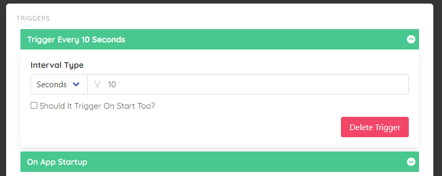
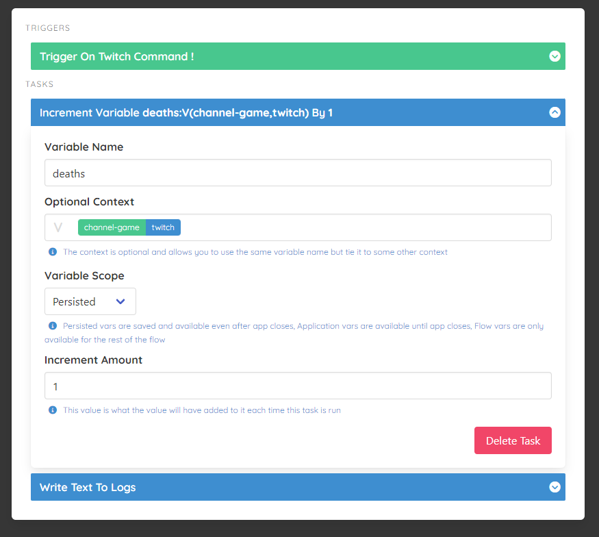
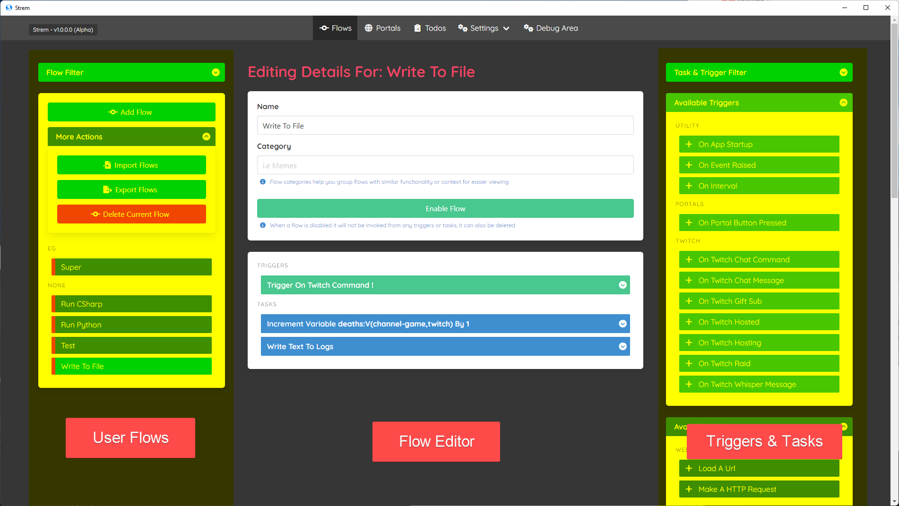
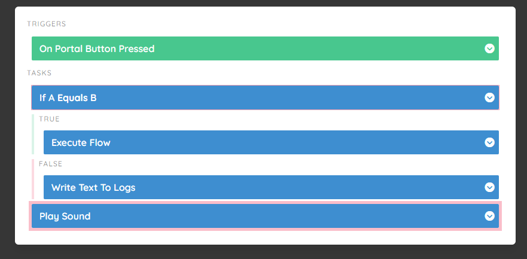
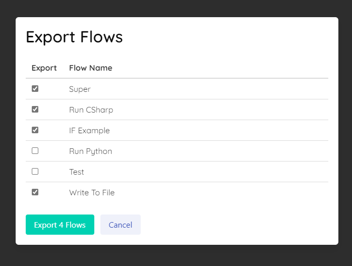

# Flows

The flows page is the brains behind the application, it's where you can setup as many `Flows` as you want and have it react to various things happening on/off stream and run logic based on those events.

## What Is A Flow?

A `Flow` is a unit of work that carries out an automated set of `tasks` and is invoked when `triggers` react to certain events.

> A good example you may want to have a `Flow` which is in charge of automatically creating a clip on twitch, however you want to trigger it when someone uses the command `!clip` in twitch chat, or when you press a button in a `Portal`.

There are 2 main parts to a `Flow` which we need to cover in a bit more detail.

### What Is A Trigger?

A trigger can be seen as the activator of a flow, without any triggers a flow would never do anything. So we can add as many triggers as we want to a flow to indicate how we want the flow to be triggered.

> You can have as many triggers setup as you want, i.e you could have a flow start on an arbitrary interval (every 60 seconds) or when someone says something in chat or an obs element is enabled etc

### What Is A Task?

A task is the part of a flow that actually does something, be it writing something out to a file, playing a sound, disabling something in OBS.

You can have as many tasks as you want and they flow on from one to the next until all tasks are complete or an error has occurred which stops the task.

> As you can see here it triggers on a twitch command and then increments a `deaths` variable for the current game on twitch and persists the value, then writes out to the log that it has done so.

## The Flow Page Layout

Now we have covered the basic parts of what a `Flow` actually is, lets get into the actual page and break down the 3 main parts available to you.

### User Flows Section

The user flows section on the left shows you all flows you as a user have created, from here you can use the `Add Flow` button create a new one, or via more actions `Import/Export` flows as well as `Delete` the current flow you are editing.

> Be aware once a flow is deleted it is gone for good, the system will warn you before hand and get you to confirm removing `Flows` but be aware it is a destructive process.

You can have as many flows as you want within the application, and name them whatever you want as well as put them into categories to make it easier to search through.

To edit a flow all you need to do is click on its name and the central section (`Flow Editor`) will show you all the triggers and tasks associated with that flow.

> There is also an optional filter section at the top left where you can type in partial text to constrain visible flows to make it easier to work with larger amount of flows if you are struggling to find one in particular.

One other thing worth noting is that Flows with a red line on the left indicate that they are `Disabled` which means they will not currently be running, you can change that state from the flow editor, by default all flows start off disabled for you to enable them when you have set them up how you would like.

### Flow Editor Section

This is the central section and probably the most complex part of the page. Within here you can change your flows name/category and also enable/disable the flow.

> Disabled flows will not be run which is handy for when you are setting them up for the first time or want to temporarily turn off certain functionality.

The next section down from the `Flow Details` area is the `Trigger` and `Task` sections which allow you to drag and drop the coresponding items into the flow. 

As mentioned before flows run from top to bottom so if you are setting up variables in a flow to be used later on you need to make sure they are ordered correctly. You can adjust their ordering by dragging them to new positions in the flow.

##### Sub Tasks

This is more of a niche scenario but in some cases you may find that you want to do 1 or more different outcomes based on a scenario, i.e you press a button in a portal and show/hide something in OBS, or more elaborate flows.

As you can see here we have an `if statement` that will execute the true OR false path depending on its outcome, which allows you to drive different behaviour based on the output. Also in this example you can see after the `if statement` it plays a sound regardless of if it is true or false.

> You can nest sub tasks if you need to, i.e an `if` within an `if` as much as you need to, but if you end up with really complicated `if` trees it may be easier to write some custom `CSharp` or `Python` code in a task to express the complex intent.

#### Dynamic Inputs

Some Triggers & Tasks will allow you to use dynamic inputs to provide values, by this it means that you can provide the system either a hard coded value i.e `5` or you can tell it to use an existing variable i.e `V(var-name)`.

It is easy to see at a glance what inputs support this by looking for the `V` symbol on the left, and they will also try to point out the variables you are using as well, as shown below.

When you activate the input you will see the actual `V(username, twitch)` text which you can edit, but as you can see on the left the `V` indicates that this input will take both hard coded values and dynamic variables.

> As you can see the variable syntax for embedding is `V(var-name, var-context)` although you can omit the context if its the only variable of its name that exists. The system is clever enough to look in your `Flow Variables` then in `User Variables` then `Transient/Temp Variables` to find your vars.

When you are using these inputs you can click on the `Output Variables` shown on other tasks/triggers/integrations which will copy the required syntax for you to paste into your inputs.

#### Validation Of Triggers & Tasks

The system tries to keep out or your way and let you do whatever crazy stuff you want, but it will flag validation issues on tasks/triggers wherever it sees that you are potentially making a mistake and flash around the relevant trigger or task to indicate to you that something is potentially wrong.

> The system wont stop you continuing with validation errors but when executing if the system finds any triggers or tasks failing validation checks it will stop processing.

## Triggers & Tasks Section

There are a myriad of out the box triggers and tasks which will be available to you based on what you have setup. For example if you have not integrated with `twitch` you will not be able to use any twitch related triggers or tasks.

> With this in mind you can go to the filter at the top right and check `Show Disabled Elements` which will show you all available triggers and tasks even if they are not usable.

As with user flows the triggers and tasks are categorised and you can mix and match them however you want by just dragging them into the relevant section.

> The flows are automatically saved whenever changes are detected so you do not need to worry about manually saving anything it is all handled for you.

## Other Useful Information

While that about covers the high level UI there are some other things to discuss which may be helpful in getting up and running.

### Importing & Exporting Flows?

Your flows are saved against your active user profile in windows however if you want to back up or share your flows with other people all you need to do is click the `Export Flows` button and then pick which flows you want to export and a file where you want to export them to, as shown below.

Once you export them you will have a `json` file which contains all your exported flows and this can be given to someone else to import into their app, which makes it super easy to share content with others.

To `Import Flows` you click the import button and provide it the `json` file you have been given and it will attempt to import any flows it can find, any errors will be reported in the logs.

#### What About Variables?

When importing and exporting you only really need the flow, as variables will be created on the fly when needed for any assignment related events, so in most cases the variables will be created when your imported flows run for the first time.

If however you have a scenario where you need to set user variables you can manually go to the `Data` section in `Settings` and manually add/remove variables there.

> As noted variables dont always need to be created ahead of time, if you have a death counter and you are incrementing a variable, if that variable doesnt exist it is created as part of the operation so you rarely need to manually go and create variables outside of flow tasks.

### Debugging Failing Flows

If you have a made a flow and it doesnt work as you expect in most cases the things you can try to assist debugging is:

- Verify none of your triggers/tasks have validation errors
- Verify any variables contain values you expect
- Go to the `Logs` page and check the `Execution Log` to see what happened
- Check the main `App Logs` to see if any errors are being output there
- Raise a query on the github issues with as much information as you can

In most cases its apparent why something is broken and its easy to fix, however in some cases there may legitimately be a bug with a task/trigger or there could be some other issue at fault.
